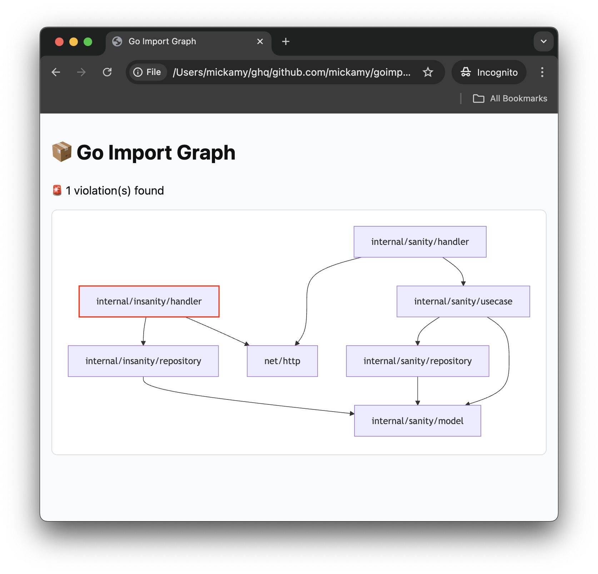

# goimportmaps

> Visualize and validate package dependencies in your Go project.
>



## Overview

`goimportmaps` is a CLI tool that analyzes your Go project's internal package imports, visualizes them as a dependency
graph, and detects architectural violations like forbidden dependencies or unexpected imports.

Ideal for large-scale or monorepo Go applications, this tool helps ensure architectural integrity by preventing
undesired package-level coupling.

## Features

- 📊 Visualize internal package dependencies (Mermaid, Graphviz, HTML)
- 🚨 Detect forbidden imports based on custom rules (`forbidden` mode)
- 🛡 Enforce allowed imports strictly (`allowed` mode, whitelist style)
- ✅ Output violations with actionable messages
- 🔍 Highlight architectural drift in pull requests
- 🧠 Perfect for layered, hexagonal, or clean architecture

## Installation

```bash
# Install goimportmaps into your project
go get -tool github.com/mickamy/goimportmaps/cmd/goimportmaps@latest

# or install it globally
go install github.com/mickamy/goimportmaps/cmd/goimportmaps@latest
```

## Usage

```bash
goimportmaps ./...
```

You can also scope the analysis to specific subdirectories:

```bash
goimportmaps ./internal/...
```

### Options

| Option     | Description                                             |
|------------|---------------------------------------------------------|
| `--format` | Output format: `text`, `mermaid`, `html`, or `graphviz` |
| `--mode`   | Validation mode: `forbidden` (default) or `allowed`     |

## Example

Given the following structure:

```
main
├── handler
│   └── user_handler.go (imports service)
├── service
│   └── user_service.go (imports infra)
└── infra
    └── db.go
```

### Forbidden Mode (default)

If `handler` imports `infra` directly, the tool will detect:

```bash
🚨 1 violation(s) found

🚨 Violation: github.com/your/project/internal/handler imports github.com/your/project/internal/infra
```

### Allowed Mode (strict whitelist)

You can enforce exact allowed imports:

```yaml
allowed:
  - source: github.com/your/project/internal/handler
    imports:
      - github.com/your/project/internal/service
    stdlib: true # allow importing standard library packages as well (default: true)
```

If `handler` tries to import anything other than `service` or stdlib (e.g., `infra`), it will be flagged.

---

### Mermaid Output Example

```markdown
graph TD
  main --> handler
  handler --> service
  service --> infra
  handler --> infra %% ❌
```

---

## Configuration

`.goimportmaps.yaml`

### Forbidden Mode Example

```yaml
forbidden:
  - source: github.com/your/project/internal/handler
    imports:
      - github.com/your/project/internal/infra
  - source: github.com/your/project/internal/app
    imports:
      - github.com/your/project/internal/db
```

### Allowed Mode Example

```yaml
allowed:
  - source: github.com/your/project/internal/handler
    imports:
      - github.com/your/project/internal/service
  - source: github.com/your/project/internal/service
    imports:
      - github.com/your/project/internal/repository
    stdlib: false
```

## HTML Output

Use `--format=html` to generate a standalone static report:

```bash
goimportmaps ./... --format=html > report.html

```

This report can be viewed in your browser or uploaded as a CI artifact.

## License

[MIT](./LICENSE)
